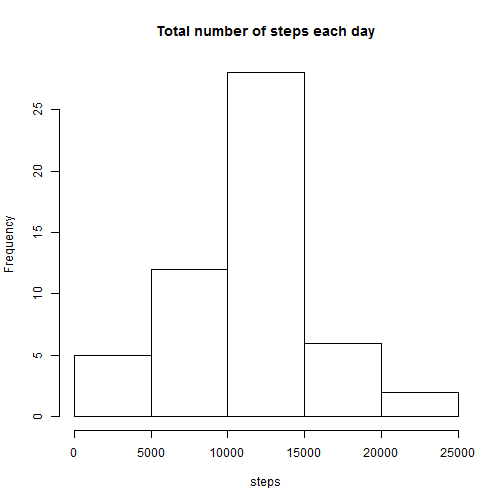
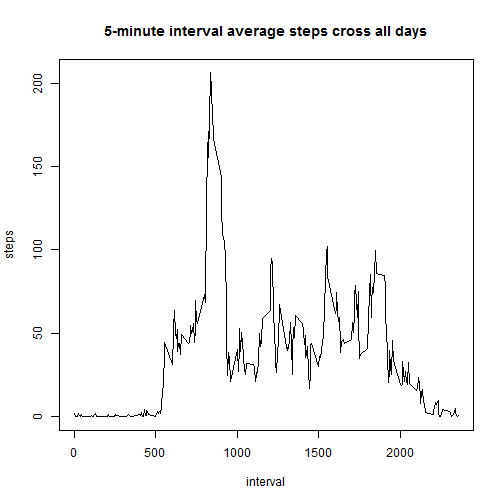
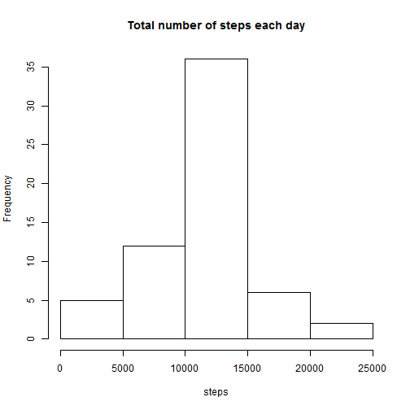
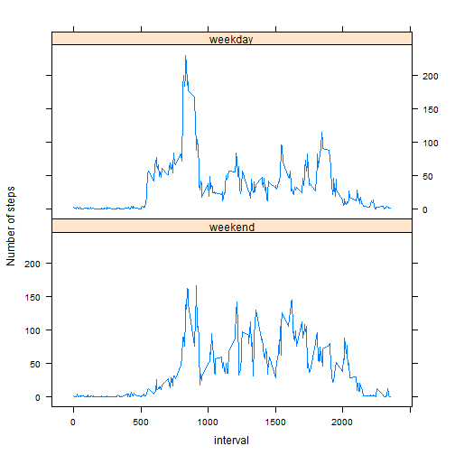

# Reproducible Research: Peer Assessment 1


## Loading and preprocessing the data

```r
activity<-read.csv("activity.csv")
activity<-transform(activity,date=as.Date(date))
```


## What is mean total number of steps taken per day?
1.Make a histogram of the total number of steps taken each day

```r
hist(tapply(activity$steps,activity$date,sum),
     main="Total number of steps each day",xlab="steps")
```

 

2.Calculate and report the mean and median total number of steps taken per day

```r
m1<-mean(tapply(activity$steps,activity$date,sum),na.rm=TRUE)
m2<-median(tapply(activity$steps,activity$date,sum),na.rm=TRUE)
```
The mean of total number of steps taken per day is 1.0766 &times; 10<sup>4</sup>.    
The median of total number of steps taken per day is 10765.

## What is the average daily activity pattern?
1.Make a time series plot of the 5-minute interval and the average number of steps taken, averaged across all days

```r
fiveAvg=tapply(activity$steps,activity$interval,mean,na.rm=TRUE)
plot(names(fiveAvg),fiveAvg,type="l",main="5-minute interval average steps cross all days",xlab="interval",ylab="steps")
```

 

2.Which 5-minute interval, on average across all the days in the dataset, contains the maximum number of steps?

```r
max5minute<-names(fiveAvg)[which.max(fiveAvg)]
```
The 835 5-minute interval contains maximum number of steps.  

## Imputing missing values
1.Calculate and report the total number of missing values in the dataset

```r
missnum<-table(!complete.cases(activity))["TRUE"]
```
There are 2304 missing values in the dateset.

2.Use the mean for that 5-minute interval in all of the missing values in the dataset

3.Create a new dataset that is equal to the original dataset with the missing data filled in

```r
#get NA step's interval and change to character
interval<-as.character(activity[!complete.cases(activity),"interval"])
#create a new data set and fill in the missing vaule the mean of it's interval
activity2<-activity
activity2[!complete.cases(activity),"steps"]<-fiveAvg[interval]
```

4.Make a histogram of the total number of steps taken each day and Calculate and report the mean and median total number of steps taken per day

```r
hist(tapply(activity2$steps,activity2$date,sum),
     main="Total number of steps each day",xlab="steps")
```

 

```r
m1<-mean(tapply(activity2$steps,activity2$date,sum))
m2<-median(tapply(activity2$steps,activity2$date,sum))
```
The mean of total number of steps taken per day is 1.0766 &times; 10<sup>4</sup>.    
The median of total number of steps taken per day is 1.0766 &times; 10<sup>4</sup>.

## Are there differences in activity patterns between weekdays and weekends?

```r
#get weekend or weekday factors
weekdays<-factor(weekdays(activity$date)!="ÐÇÆÚÈÕ"&weekdays(activity$date)!="ÐÇÆÚÁù",labels=c("weekend","weekday"))
#get weekend and weekday's 5minute average steps respectively
fiveAvg_weekend=tapply(activity2[weekdays=="weekend","steps"],
                       activity2[weekdays=="weekend","interval"],mean)
fiveAvg_weekday=tapply(activity2[weekdays=="weekday","steps"],
                       activity2[weekdays=="weekday","interval"],mean)
#plot data
library(lattice)
f<-rep(0:1,each=length(fiveAvg_weekend))
f<-factor(f,labels=c("weekend","weekday"))
y<-c(fiveAvg_weekend,fiveAvg_weekday)
x<-as.integer(names(y))
xyplot(y~x | f, layout = c(1, 2),xlab="interval",ylab="Number of steps",
       panel = function(x, y, ...) {panel.xyplot(x, y,type='l')} )
```

 

In early morning,there are differences in activity patterns between weekdays and weekends
